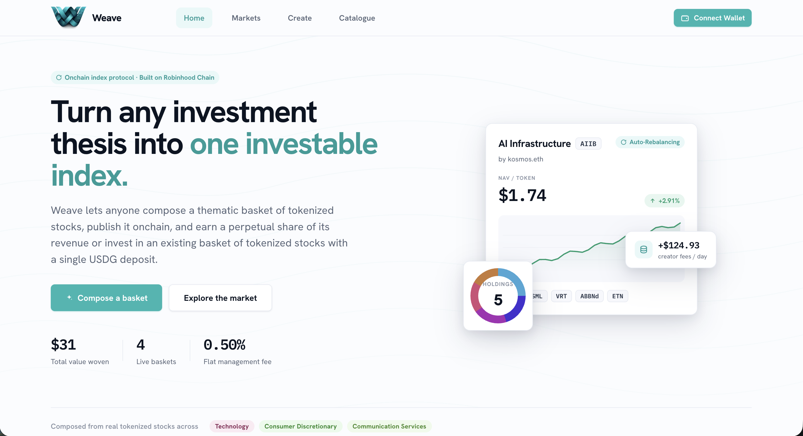
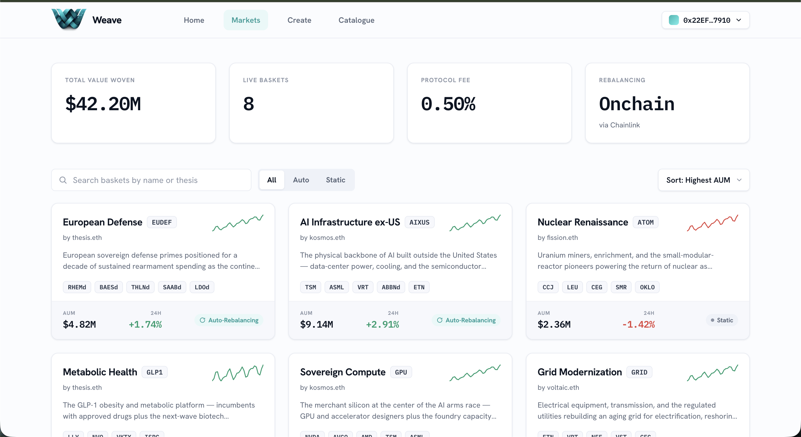
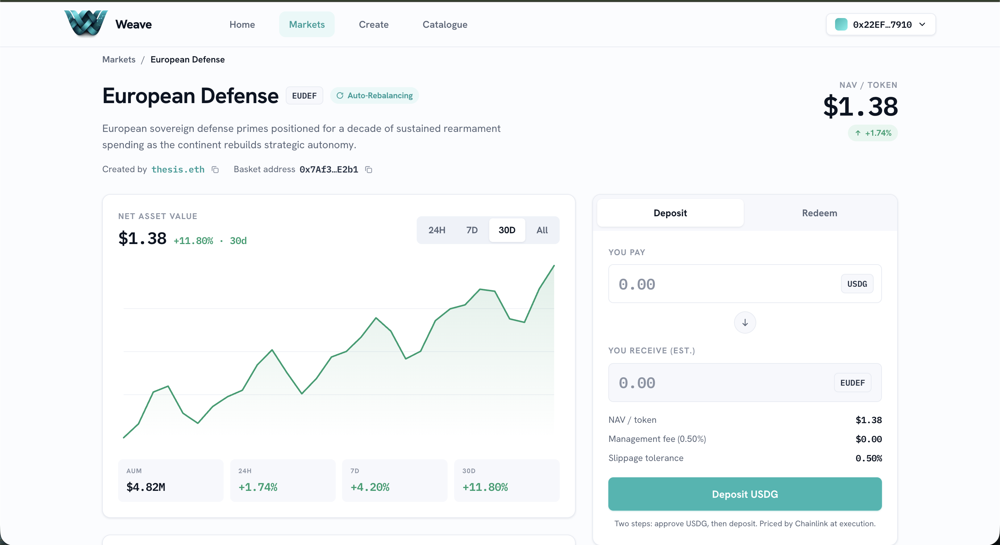
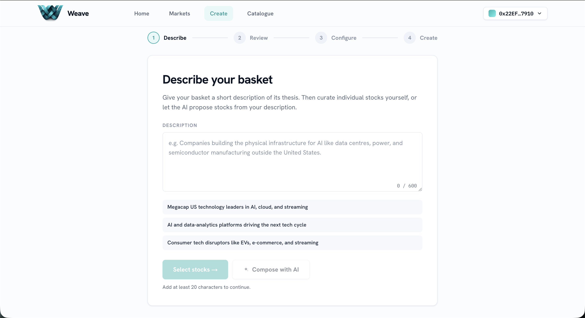

# Weave Frontend — Onchain Index Protocol for Tokenized Equities

> Built during the Arbitrum Open House London: Online Buildathon, 2026
>
> **Team:** Yemi (Ikeh Chukwuka Favour) & Chris Ebube Roland — OCD Labs

The web client for **Weave**, a protocol that lets anyone compose a thematic basket of tokenized stocks from Robinhood Chain's catalogue, publish it as a single investable onchain instrument, and earn a continuous share of the revenue it generates. This repository is the Next.js frontend. It talks to the [Weave backend](https://github.com/OCD-Labs/Weave) for indexed data and AI composition, and directly to the protocol contracts for deposits, redemptions, basket creation, and revenue claims.

<!-- SCREENSHOT: landing page hero -->
<p align="center">
  
</p>

---

## Table of Contents

- [Overview](#overview)
- [Screens](#screens)
- [Architecture](#architecture)
- [Tech Stack](#tech-stack)
- [Project Structure](#project-structure)
- [Data Layer](#data-layer)
- [Onchain Integration](#onchain-integration)
- [Local Development](#local-development)
- [Environment Variables](#environment-variables)
- [Deployment](#deployment)

---

## Overview

Weave turns thematic investing into a creator economy. Two audiences meet in the product:

- **Investors** browse live baskets, deposit USDG in a single transaction, hold a diversified ERC-20 that is priced live by oracles, and redeem anytime at current NAV.
- **Creators** describe a thesis in plain language, let the AI composition engine propose a weighted basket from the catalogue, review and adjust it, then deploy it onchain and earn 80% of its management fee in perpetuity through ERC-7641 revenue sharing.

The frontend renders both journeys against live protocol data, with a dev-only mock mode so the full UI can be explored without a wallet or a funded testnet account.

---

## Screens

| Route | Screen | Description |
|---|---|---|
| `/` | Landing | Marketing entry point. Hero, how-it-works, the AI engine, and featured live baskets. |
| `/markets` | Marketplace | All published baskets with NAV, AUM, 24h change, sparkline, and filters. |
| `/baskets/:address` | Basket detail | NAV chart, composition donut, holdings table, drift indicator, activity feed, and a deposit/redeem panel. |
| `/create` | Create wizard | Describe a thesis, AI-compose a basket, configure weights and rebalancing, deploy onchain. |
| `/catalogue` | Catalogue | Every tokenized equity available for basket construction. |
| `/portfolio` | Portfolio | A wallet's positions, cost basis, and unrealised performance. |
| `/creator` | Creator dashboard | Published baskets, creator-token ownership, and claimable ERC-7641 revenue. |

### Markets Page
<!-- SCREENSHOT: the marketplace grid -->
<p align="center">
  
</p>

### Basket Detail Page
<!-- SCREENSHOT: a basket detail page -->
<p align="center">
  
</p>

### Create Wizard Page
<!-- SCREENSHOT: the create wizard -->
<p align="center">
  
</p>

---

## Architecture

The frontend is a stateless rendering and transaction layer. It never holds secrets and submits transactions only from the user's connected wallet.

```
┌─────────────────────────────────────────────────────────┐
│                    Next.js App Router                    │
│   Server components (routes/metadata) + client screens   │
└───────────────┬─────────────────────────┬───────────────┘
                │                          │
        Read path (data)          Write path (transactions)
                │                          │
                ▼                          ▼
   ┌────────────────────────┐   ┌──────────────────────────┐
   │   Weave Go Backend     │   │  Robinhood Chain Testnet  │
   │  REST API + AI compose │   │   WeaveRegistry, Factory, │
   │  (indexed chain state) │   │   Basket proxies, Tokens  │
   └────────────────────────┘   └──────────────────────────┘
        @tanstack/react-query        wagmi + viem + RainbowKit
```

- **Reads** come from the backend REST API (indexed, NAV-computed, AI-augmented) and are cached and revalidated with React Query.
- **Writes** (approve, deposit, redeem, create basket, claim revenue) go straight to the contracts through wagmi/viem. Every write is pre-simulated so a revert surfaces a friendly decoded message before the wallet prompt.

---

## Tech Stack

| Concern | Choice |
|---|---|
| Framework | Next.js 16 (App Router, `src/` dir, `@/*` alias) |
| Language | TypeScript |
| UI runtime | React 19 |
| Styling | Tailwind CSS v4 (`@theme inline`), HSL-driven design tokens |
| Wallets | RainbowKit + wagmi v2 + viem |
| Server state | @tanstack/react-query |
| Package manager | pnpm |

---

## Project Structure

```
src/
├── app/                      # App Router routes (one folder per screen) + layout, globals.css
│   ├── page.tsx              # Landing
│   ├── markets/              # Marketplace
│   ├── baskets/[slug]/       # Basket detail
│   ├── create/               # Create wizard
│   ├── catalogue/            # Catalogue
│   ├── portfolio/            # Portfolio
│   └── creator/              # Creator dashboard
├── components/               # Screen components grouped by domain
│   ├── landing/ marketplace/ basket/ create/ account/ catalogue/
│   ├── charts/               # NAV chart, donut, sparkline
│   ├── wallet/ toast/ controls.tsx badges.tsx icons.tsx
│   └── dev/                  # Mock/live data-source toggle
└── lib/
    ├── api/                  # REST client, typed DTOs, React Query hooks, mappers
    ├── web3/                 # chain, wagmi config, ABIs, addresses, write hooks, error decoding
    ├── data.ts aiPresets.ts  # Mock fixtures for offline/preview mode
    ├── units.ts format.ts    # Decimal conversion and display formatting
    └── dataSource.ts         # Mock vs live runtime switch
```

---

## Data Layer

Reads are served by the Go backend. The client wraps each endpoint in a typed React Query hook (`src/lib/api/`).

| Method | Path | Used by |
|---|---|---|
| `GET` | `/catalogue` | Catalogue, Create wizard |
| `GET` | `/baskets` | Marketplace, Landing |
| `GET` | `/baskets/:address` | Basket detail |
| `GET` | `/baskets/:address/performance` | NAV chart |
| `GET` | `/positions/:wallet` | Portfolio |
| `GET` | `/creator/:wallet` | Creator dashboard |
| `POST` | `/ai/compose` | Create wizard (AI composition) |

### Decimal Conventions

All token amounts arrive as raw `uint256` strings to avoid JavaScript precision loss. Convert with `lib/units` — never `parseFloat` a raw integer string.

| Asset | Decimals | Raw example | Display |
|---|---|---|---|
| USDG | 6 | `"100000000"` | $100.00 |
| Basket tokens | 18 | `"1000000000000000000"` | 1.0 |
| Oracle prices | 8 | `"49701000000"` | $497.01 |
| Weights | bps | `5000` | 50% |

### Mock mode

A dev-only toggle (`lib/dataSource.ts`, gated by `NEXT_PUBLIC_ENABLE_DATA_TOGGLE`) flips the app between the live backend and bundled fixtures, so every screen can be previewed without a backend, wallet, or funded testnet account. The switch persists to `localStorage` and is surfaced by the floating control in the bottom-left during development.

---

## Onchain Integration

The settlement token is **USDG** (6 decimals). Baskets are ERC-20s (18 decimals) priced by `navPerToken`.

- **Network:** Robinhood Chain Testnet, chain ID `46630` (`lib/web3/chain.ts`).
- **Wallets:** any RainbowKit-supported connector; WalletConnect requires a project id.
- **Contracts:** addresses resolve from env with bundled testnet defaults (`lib/web3/addresses.ts`).
- **Writes:** the two-step deposit/create flows (USDG approve, then the action) and revenue claims live in `lib/web3/useTrade.ts`, `useCreateBasket.ts`, and `useCreatorToken.ts`. Each pre-simulates and decodes custom contract errors (`lib/web3/errors.ts`) into human-readable messages.

| Contract | Role |
|---|---|
| `WeaveRegistry` | Protocol config, asset catalogue, basket index |
| `BasketFactory` | Deploys basket proxies and creator tokens |
| `BasketImplementation` | Shared basket logic and the ERC-20 basket token |
| `USDG` | Settlement / deposit token |

---

## Local Development

### Prerequisites

- Node.js 20+
- [pnpm](https://pnpm.io/)
- A WalletConnect project id (optional, for the WalletConnect connector): https://cloud.walletconnect.com

### Setup

```bash
# Install dependencies
pnpm install

# Configure environment (see table below)
cp .env.example .env.local
# fill in the NEXT_PUBLIC_* values

# Start the dev server
pnpm dev
```

Open [http://localhost:3000](http://localhost:3000).

By default the app reads from the hosted backend at `https://weave.up.railway.app` and the deployed testnet contracts, so it runs end to end with no local backend. Point `NEXT_PUBLIC_BACKEND_URL` at `http://localhost:8080` to develop against a local backend.

### Scripts

| Command | Description |
|---|---|
| `pnpm dev` | Dev server (webpack) |
| `pnpm dev:turbo` | Dev server (Turbopack) |
| `pnpm build` | Production build |
| `pnpm start` | Serve the production build |
| `pnpm lint` | ESLint |

---

## Environment Variables

All client variables are prefixed `NEXT_PUBLIC_`. Sensible testnet defaults are bundled, so the app builds and runs even with an empty `.env.local`.

| Variable | Required | Description |
|---|---|---|
| `NEXT_PUBLIC_BACKEND_URL` | No | Backend base URL. Defaults to the hosted Railway deployment. |
| `NEXT_PUBLIC_CHAIN_ID` | No | EVM chain id. Defaults to `46630`. |
| `NEXT_PUBLIC_RPC_URL` | No | RPC endpoint. Defaults to the Robinhood Chain testnet RPC. |
| `NEXT_PUBLIC_EXPLORER_URL` | No | Block explorer base for tx/address links. |
| `NEXT_PUBLIC_REGISTRY_ADDRESS` | No | WeaveRegistry address (bundled default). |
| `NEXT_PUBLIC_BASKET_FACTORY_ADDRESS` | No | BasketFactory address (bundled default). |
| `NEXT_PUBLIC_BASKET_IMPLEMENTATION_ADDRESS` | No | BasketImplementation address (bundled default). |
| `NEXT_PUBLIC_USDG_ADDRESS` | No | USDG settlement token address (bundled default). |
| `NEXT_PUBLIC_WALLETCONNECT_PROJECT_ID` | No | Enables the WalletConnect connector. |
| `NEXT_PUBLIC_ENABLE_DATA_TOGGLE` | No | Set to `1` to show the mock/live data-source switch. |
| `NEXT_PUBLIC_DATA_SOURCE` | No | Default data source, `mock` or `live`. |

---

## Deployment

The app is a standard Next.js build and deploys to any Node host or platform with Next support (Vercel, Railway, etc.).

```bash
pnpm install
pnpm build
pnpm start
```

Set the production `NEXT_PUBLIC_*` variables (in particular `NEXT_PUBLIC_BACKEND_URL`, the contract addresses, and `NEXT_PUBLIC_WALLETCONNECT_PROJECT_ID`) in your host's environment. Leave `NEXT_PUBLIC_ENABLE_DATA_TOGGLE` unset in production so the dev data switch stays hidden.

---

*Built on Robinhood Chain testnet, an Arbitrum L2 designed for tokenized real-world assets. Robinhood Chain is the only blockchain with a catalogue of tokenized equities at meaningful scale, making Weave's equity index protocol possible for the first time.*
